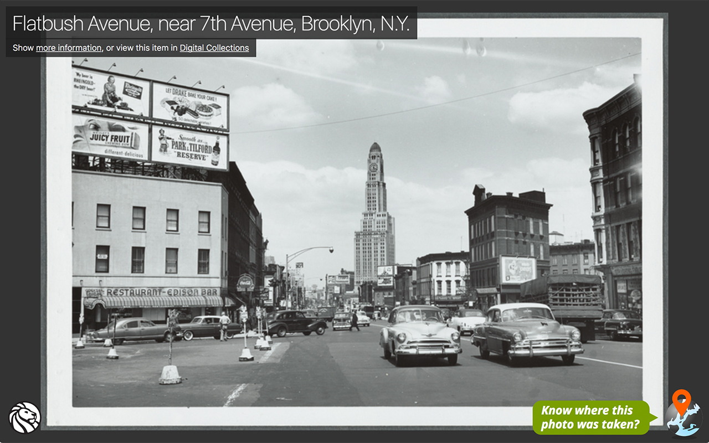

# NYPL Digital Collections Chrome New Tab Extension

A beautiful photo from The New York Public Library's [Digital Collections](http://digitalcollections.nypl.org/), every time you open a new tab!

If you know the location where the photo was taken, clicking the photo will take you to [Surveyor](http://spacetime.nypl.org/surveyor) where you can help geotag the photo collection of the New York Public Library.

## Installation

From Chrome Web Store (__coming soon!__), or clone this repository, go to [chrome://extensions](chrome://extensions), enable _Developer mode_ and click [Load unpacked extension…](https://developer.chrome.com/extensions/getstarted#unpacked).
